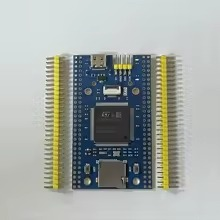
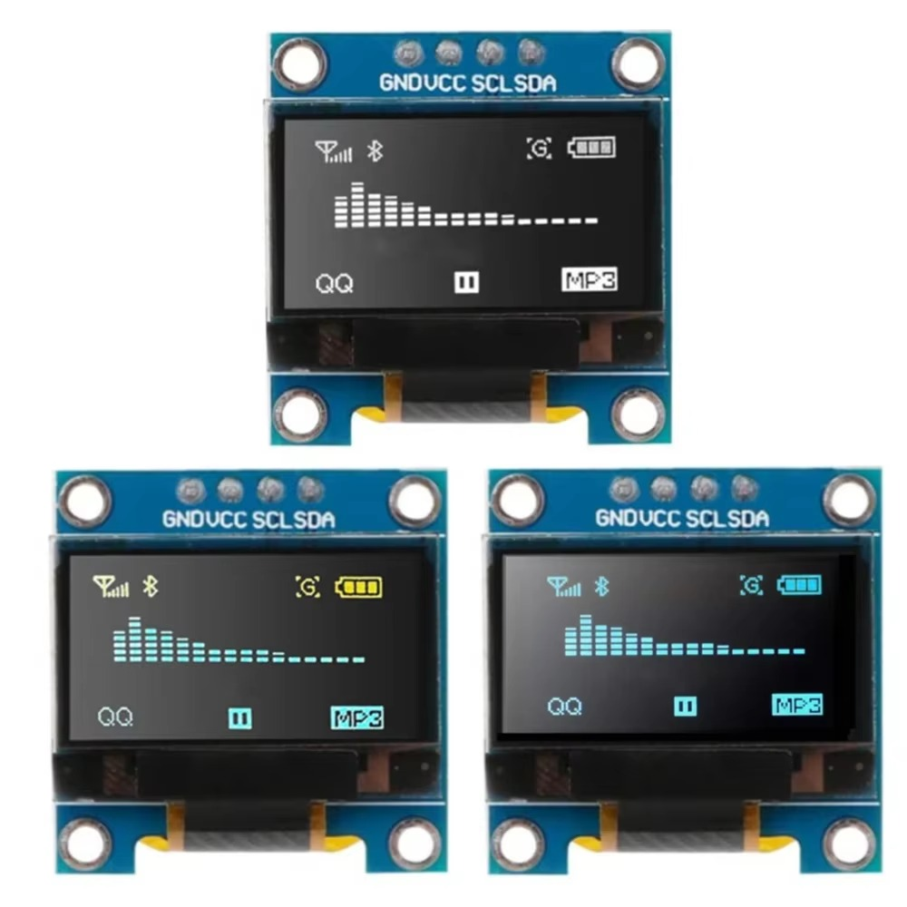
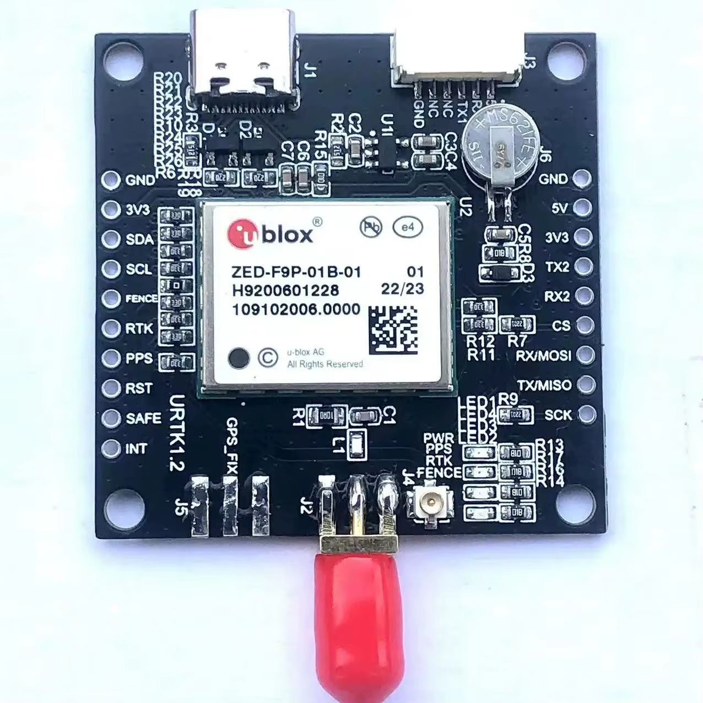

# STM32 F9P GNSS Data Logger

Low-cost STM32-based raw GNSS logger for u-blox ZED-F9P receivers. The logger records a raw UBX stream to an SD card for later PPK processing, while a small SSD1306 OLED shows live write status, file name, fix state, satellite count, UTC time, and overrun warnings.

This project was built around an STM32F407ZGT6 board with SDIO SD card access, FatFS, UART DMA receive, and a 128x64 SSD1306 OLED.

## What It Does

- Logs the incoming F9P UBX byte stream directly to SD card.
- Creates incrementing files such as `GNSS001.UBX`, `GNSS002.UBX`, and so on.
- Uses UART DMA circular buffering to reduce packet loss risk.
- Displays SD write status and overrun warnings on OLED.
- Parses `UBX-NAV-PVT` passively for UTC time, fix type, and satellite count.
- Uses GNSS UTC time for FatFS file timestamps once valid time is available.

## Hardware Used

Listings may change, and equivalent boards/modules should work if the pinout, voltage levels, and interfaces match.


### STM32F407ZGT6 Board
cost: $14.60




Purchase link: [AliExpress STM32F407ZGT6 board](https://www.aliexpress.us/item/3256809863003361.html?spm=a2g0o.order_list.order_list_main.41.49c11802SIBgZa&gatewayAdapt=glo2usa)


### SSD1306 OLED
cost: $2.60



Purchase link: [AliExpress SSD1306 OLED](https://www.aliexpress.us/item/3256805954920554.html?spm=a2g0o.order_list.order_list_main.29.49c11802SIBgZa&gatewayAdapt=glo2usa)


### ZED-F9P Module
cost: $103.62



Purchase link: [AliExpress ZED-F9P module](https://www.aliexpress.us/item/3256806049727804.html?spm=a2g0o.order_list.order_list_main.131.49c11802SIBgZa&gatewayAdapt=glo2usa)

## Prerequisites

Install the STM32 development tools from STMicroelectronics:

- STM32CubeMX
- STM32CubeIDE
- STM32CubeProgrammer

Download them from the official ST website:

https://www.st.com/en/development-tools/stm32-software-development-tools.html

Install u-blox u-center for configuring and testing the ZED-F9P:

- u-center GNSS evaluation software

Download from u-blox:

https://www.u-blox.com/en/product/u-center

Recommended workflow:

- Use STM32CubeMX to inspect or regenerate peripheral configuration.
- Use STM32CubeIDE to build/import the firmware project.
- Use STM32CubeProgrammer to flash the compiled firmware to the STM32 board.
- `NOTE: BOOT0 jumper must be soldered in order to flash board, then unsoldered to run program. Recommend install of a switch or two wires to simplify multiple flashes of board`
- Use FAT32 formatted SD card inserted into onboard STM32 slot.
- Use u-center to configure the F9P output messages and verify `.UBX` log playback.

## IMPORTANT

The STM32 sends a `cold-start` command to the F9P at boot. This requires the `PA9 / USART1 TX` connection to the `F9P UART RX` pin. The purpose is to prevent a portable base from silently reusing stale retained navigation/survey state after being moved. If `hot-start` is needed (for rover configuration) simply do not connect this wire.

## QUICK START

- [Build and Flash](docs/BUILD_AND_FLASH.md)
- [F9P Configuration](docs/F9P_CONFIGURATION.md)

## Recommended F9P Output Messages

For PPK logging, enable on `UART 1` (or whichever F9P `PORT` is connected to STM32 `Rx` pin):

- `UBX-RXM-RAWX`
- `UBX-RXM-SFRBX`
- `UBX-NAV-PVT` at 1 Hz
- `UBX-NAV-SVIN` at 1 Hz

Optional:

- `UBX-NAV-SAT` at 1 Hz for richer satellite diagnostics

Disable unnecessary `NMEA` and high-rate navigation messages unless you have confirmed the UART and SD write pipeline have enough bandwidth.


## OLED Logging Screen

Typical boot up / logging screen:


Warnings:

- `WARNING OVERRUN`: UART receive/write pipeline fell behind. The log may have dropped bytes.
- `NO GNSS DATA`: no recent valid `NAV-PVT` packet has been parsed.
- Fix type flashes if the solution is not acceptable for PPK.
- `SURVEYING IN` flashes until base position is `SURVEY IN OK`.
- `TIME` is the standard fix type once position is surveyed-in.
- If `SAT=0` and `NO FIX`, check antenna.

## Optional External New-Log Button

It might be of interest to add a button to start/stop recording, by advancing to a new file. This would be for using the f9p configured as a rover, instead of a static base station. Separate .ubx files could be logged to discriminate between multiple ground control points.

The onboard FK407M2-ZGT6 `KEY` button was not reliable as a readable GPIO during testing. Button-triggered file rotation is disabled by default.

The firmware includes a disabled compile-time option for a future external momentary switch. Wire a switch between a confirmed-free GPIO header pin and GND, then enable the option in `main.c`:

```c
#define BUTTON_ROTATE_LOG_ENABLED 1
#define BUTTON_ROTATE_LOG_PORT GPIOE
#define BUTTON_ROTATE_LOG_PIN GPIO_PIN_4
```

The firmware configures the selected pin with `GPIO_PULLUP`, so the button press pulls the pin low.

## Important Reliability Notes

- For PPK, dropped bytes matter. Watch `WARNING OVERRUN`.
- Use a good SD card and avoid removing power before writes are synced.
- Keep unnecessary f9p receiver messages disabled. We want bandwidth to remain as lean as possible.
- Confirm logged `.UBX` files open correctly in u-center before relying on field data.
- Long-duration testing is strongly recommended before survey use.

